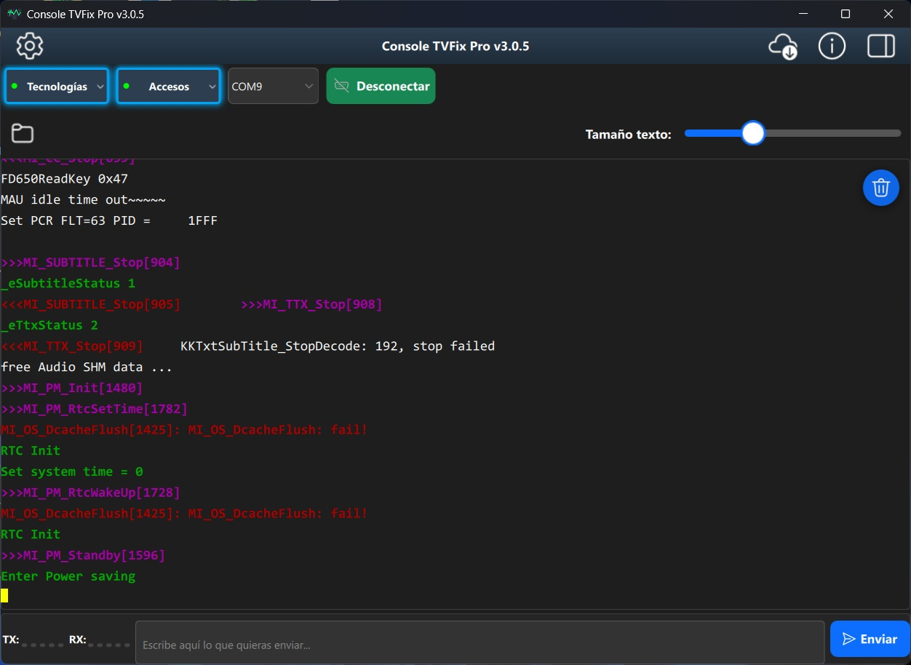

# Console TVFix Pro v3

**Console TVFix Pro** is a premium, cross-platform application designed for advanced communication with Smart TVs via serial interfaces. It offers a powerful terminal environment, extensive command libraries for various TV chipset technologies, and robust security features, all within a modern, easy-to-use interface.

> **Note**: This repository is **private**. The source code is not publicly available. This document describes the application's capabilities and usage.

--

## ✨ Features

- **Cross-platform compatibility**: Windows (x64) and Android (ARMv7/ARM64).

- **Serial communication**: Connect to TVs via physical COM ports (Windows) or USB-OTG (Android).

- **Bluetooth Terminal**: Connect via Bluetooth (Android).

- **Advanced terminal emulation**: Full ANSI/VT100 compatibility, 256 colors, and real-time TX/RX activity indicators.

- **Predefined command libraries**: One-click commands for major TV technologies:
  - MSTAR, REALTEK, MEDIATEK (DTV and MT58XX), SONY DTV/MT58XX, NUGGUET, PANASONIC, HISILICON, AMLOGIC, NOVATEK, SAMSUNG, HISENSE, LG.

- **Custom command editor**: Create, edit, and organize your own command sequences by technology.

- **Recovery commands**: Dedicated section for accessing recovery modes on different platforms.

- **Continuous sending**: Automatically repeats a key or command (e.g., "ENTER") to access DEBUG mode.

- **Automatic logging**: All terminal activity is saved to timestamped log files. Easily access the log folder from the UI.

- **Licensing and anti-debug protection** – Secure licensing mechanism and anti-debug protection for premium distribution.

- **Update notifications** – Checks for new versions on GitHub (Windows) and offers downloads from within the app.

- **Localization** – Interface available in English and Spanish.

--

## 📱 Compatible Hardware (Android OTG)

When using **Android** with a USB-OTG cable, the app is compatible with a wide range of USB-to-serial converter chips driver.
Supported chipsets include:

- **FTDI** – FT232R, FT232H, FT2232H, FT4232H, FT230X, FT231X, FT234XD
- **Prolific** – PL2303
- **Silicon Labs** – CP2102, CP210*
- **WCH** – CH340, CH341A, CH9102
- **CDC/ACM** – Arduino (ATmega32U4), Digispark (V-USB), Microchip MCP2221

---

## 🖥️ Windows Requirements

- Windows 10 (1809 or later) (x64)
- Physical serial port or USB-to-serial adapter

---

## 📲 Android Requirements

- Android 9 (API 28) or higher
- USB-OTG cable (for serial communication)
- Permissions automatically requested when running the app for the first time:
  - Bluetooth
  - Location (required for Bluetooth discovery on Android 12+)
  - Manage external storage (for logs and license files)

---

## 🛠️ Usage (Quick Start)

1. **Launch the app**.

2. **Select the connection type** (Serial or Bluetooth) and configure the port/baud rate (default is set to 115200).

3. **Choose the TV technology** from the "Technologies" button (or select "Recovery" for generic commands).

4. **Use the command menus** on the right:
   - **Predefined**: Commands specific to the selected technology.
   - **Custom** – Your own saved command sequences.
   - **Recovery** – Recovery mode commands for various chips.

5. **Type commands manually** in the bottom input field and press **Send**.

6. **Monitor activity** using the TX/RX meters and scroll through the terminal output.

7. **Update the app** – The Windows version checks for updates automatically.

--

## 🔒 Licensing

Console TVFix Pro is a **commercial application**. A valid license file (`license_for_user.dat`) is required to run the application.

When launching the app for the first time, a `serial.dat` file will be generated. This file must be sent to the developer to obtain the corresponding license.

Once the license is placed in the application's data directory, all features will be available.

---

## 📞 Support and Contact

For licensing, technical support, or feature requests, contact the developer:

- **Yoel Romero H.** – 5356113984
- **YouTube**: [@yoelcode](https://www.youtube.com/@yoelcode)
- **GitHub**: [YoelCode‑ui](https://github.com/YoelCode-ui)

---

## ⚙️ Developer Notes

- The source code **is not public**. This repository serves only as a project summary and release page.

- All communication is done using standard serial protocols. No proprietary hardware is required, only a USB-to-serial converter.

--

## 📄 License

© 2026 Console TVFix Pro – All rights reserved.
Redistribution, reverse engineering, or unauthorized use is strictly prohibited.
