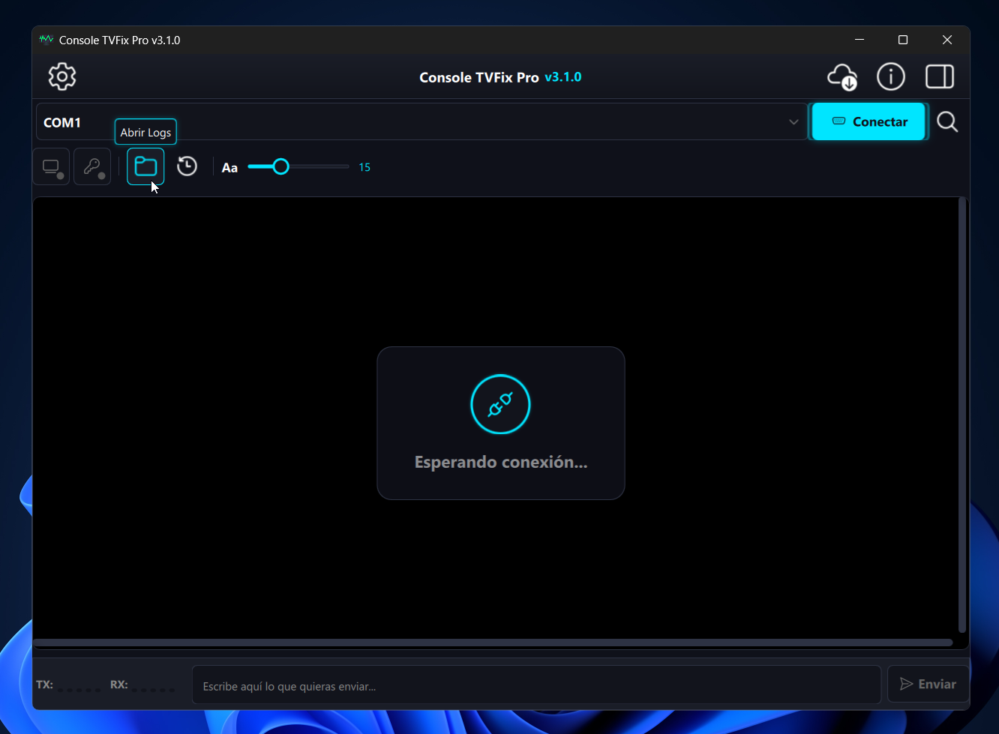

# Console TVFix Pro v3

**Console TVFix Pro** is a premium, cross-platform application designed for advanced communication and diagnostics for Smart TVs through serial interfaces. Powered by a high-performance graphics engine and a modern interface, it provides a robust terminal environment, extensive command libraries for a wide range of chipset technologies, real-time telemetry, and commercial-grade security tools.

> **Note**: This repository is **private**. The source code is not publicly available. This document describes the application's capabilities and usage.

---

## ✨ Features

### 🔌 Connectivity and Serial Communication
- **Cross-platform support**: Fully compatible with Windows (x64) and Android (ARMv7/ARM64).
- **Physical serial and OTG connections**: Connect to TVs through physical COM ports on Windows or via USB-OTG cables on Android.
- **Bluetooth terminal**: Built-in support for wireless diagnostic connections via Bluetooth (Android only).
- **Advanced port configuration**: Full control over connection parameters, including baud rates (from 1200 to 230400 bps), data bits (5 to 8), stop bits (1, 1.5, 2), and parity (None, Even, Odd, Mark, Space).
- **Safe disconnect handling**: Smart toast-style notifications that immediately alert you to unexpected hardware disconnections.

### 🖥️ Terminal Engine and Monitoring
- **Advanced emulation**: Full compatibility with ANSI/VT100 standards and 256-color terminal output.
- **Real-time telemetry (live meter)**: Dynamic visual indicators that monitor TX/RX activity instantly.
- **Integrated search tool**: Search the terminal log in real time to quickly find errors or specific text strings.
- **Smart auto-scroll control**: Auto-scroll disables automatically when the user scrolls up to review history, making reading easier.
- **Continuous sending**: Automatically repeats commands or key presses (for example, `ENTER`) to force access to DEBUG modes during TV startup.

### 📚 Smart Command Management
- **Predefined technology libraries**: One-click commands for the main motherboard and chipset families on the market, including:
  - MSTAR
  - REALTEK
  - MEDIATEK (DTV and MT58XX)
  - SONY DTV / MT58XX
  - NUGGUET
  - PANASONIC
  - HISILICON
  - AMLOGIC
  - NOVATEK
  - SAMSUNG
  - HISENSE
  - LG
- **Smart color coding**: The interface automatically assigns a specific color to each technology for faster visual identification and fewer mistakes.
- **Custom command editor**: Dedicated interface to create, edit, delete, and organize your own command sequences by technology.
- **Recovery commands**: A dedicated tab for quick access to recovery modes on different platforms.
- **Visual command tokenization**: The system recognizes and highlights escape sequences such as `\r`, `\n`, and `\t` inside command buttons so you know exactly which hexadecimal code will be sent.

### 🎨 Adaptive Interface and Graphics Performance
- **Fully responsive design**: The interface adapts dynamically whether you are on a large desktop display or a mobile device, intelligently adjusting panels, tab bars, and touch areas.
- **Virtual keyboard handling**: On Android, the terminal automatically calculates the on-screen keyboard height to resize the reading area and avoid hiding important information.
- **Performance control panel**: Fine-grained tuning that lets users balance visual polish against resource usage. It offers 5 profiles, from Maximum Performance to Maximum Quality, with the ability to enable or disable:
  - Smooth animations and transitions
  - Cursor blinking and visual attention effects
  - Deep shadows and glow effects
  - Dynamic recoloring of vector icons

### 📂 Operation Logging
- **Automatic log saving**: Configurable option to save all terminal traffic to timestamped log files automatically when disconnecting.
- **Quick folder access**: Easily open the log folder from the graphical interface to audit repairs or share reports.

### 🛡️ Security, Updates, and Localization
- **Licensing and anti-debug protection**: Robust hardware-bound licensing mechanism (`serial.dat` and `license_for_user.dat`) with built-in protection against reverse engineering.
- **OTA update manager**: The software automatically checks whether new versions are available on the server and offers direct downloads from inside the app (Windows).
- **Real-time multilingual interface**: Available in English and Spanish, with a built-in language selector in the settings panel.

---

## 📱 Compatible Hardware (Android OTG)

When using **Android** with a USB-OTG adapter, the application includes native drivers compatible with a wide variety of USB-to-serial converters. Supported chipsets include:

- **FTDI**: FT232R, FT232H, FT2232H, FT4232H, FT230X, FT231X, FT234XD
- **Prolific**: PL2303
- **Silicon Labs**: CP2102, CP210*
- **WCH**: CH340, CH341A, CH9102
- **CDC/ACM**: Arduino (ATmega32U4), Digispark (V-USB), Microchip MCP2221

---

## 🖥️ Windows Requirements

- Windows 10 (version 1809 or later) (x64)
- Physical serial port or USB-to-serial adapter

---

## 📲 Android Requirements

- Android 9 (API 28) or later
- USB-OTG cable or adapter for serial communication
- Permissions automatically requested on first launch:
  - Bluetooth
  - Location (required by Android 12+ for Bluetooth discovery)
  - External storage access (for logs and license files)

---

## 🛠️ Quick Start

1. Launch the application.
2. Open the Settings panel and choose the connection type (Serial or Bluetooth), then adjust baud rate, data bits, and parity according to the TV board you want to diagnose.
3. Select the TV technology from the **Technologies** menu, or choose **Recovery** for boot utilities.
4. Use the right-side panel to access:
   - **Predefined**: Tested commands for the selected technology.
   - **Custom**: Your own saved scripts and command sequences.
   - **Recovery**: System recovery routines.
5. Click any command to send it, or type manually in the bottom input field and press **Send**.
6. Monitor the RX/TX meters in real time and use the search bar to find specific blocks of code in the terminal output.

---

## 🔒 Licensing and Installation

Console TVFix Pro is a **commercial application**. A valid license file (`license_for_user.dat`) is required to unlock its full capabilities.

1. On first launch, the system generates a unique fingerprint file named `serial.dat`.
2. This file must be sent to the developer to generate the corresponding cryptographic license.
3. Once the license is received, place it in the application's data directory to activate the software permanently.

---

## 📞 Support and Contact

For licensing, technical support, or feature requests, contact the developer:

- **Yoel Romero H.** – 5356113984
- **YouTube**: @yoelcode
- **GitHub**: YoelCode-ui

---

## ⚙️ Development Notes

- This repository serves only as a roadmap and release portal.
- The source code is proprietary and is not publicly available.
- All communication uses standard serial protocols. No proprietary hardware or external flashing boxes are required; a simple USB-to-TTL/Serial adapter is enough.

---

## 📄 Copyright

© 2026 Console TVFix Pro – All rights reserved. Redistribution, reverse engineering, modification, or unauthorized use of this software is strictly prohibited.
